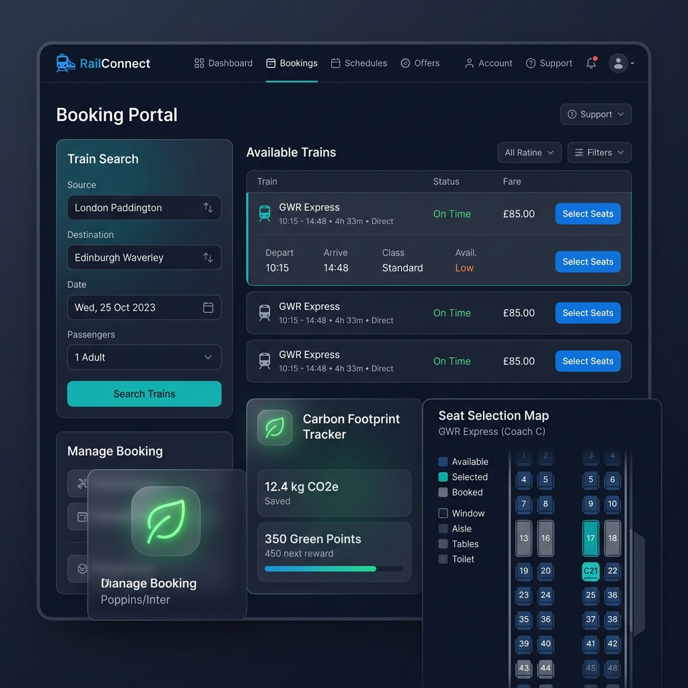
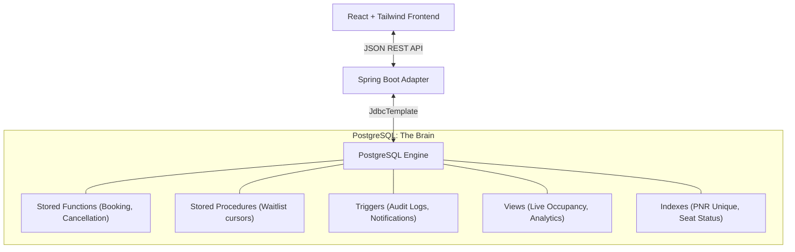

# 🚄 RailConnect — Advanced Railway Reservation System



[](https://www.postgresql.org/)
[](https://www.oracle.com/java/)
[](https://spring.io/projects/spring-boot)
[](https://reactjs.org/)
[](https://tailwindcss.com/)

**RailConnect** is a state-of-the-art railway reservation system engineered with a **"DBMS-Pivot" Architecture**. Unlike traditional monolithic applications, RailConnect offloads critical business logic, transactional integrity, and high-concurrency management directly to the **PostgreSQL** engine, ensuring unparalleled data consistency and performance.

---

## 🏗️ The "DBMS-Pivot" Architecture

RailConnect leverages a **Function-Pivot** model. The Spring Boot backend serves as a lightweight RESTful adapter, while the database handles the heavy lifting through advanced PL/pgSQL constructs.



---

## ✨ Key Features

### 🔐 Atomic Transaction Engine
Every booking is an atomic unit. The system uses complex stored functions to parse passenger data, verify identity uniqueness, calculate dynamic fares, and allocate seats—all within a single database transaction to prevent partial state failures.

### ⚡ Non-Blocking Concurrency
By utilizing PostgreSQL's `FOR UPDATE SKIP LOCKED` mechanism, RailConnect handles hundreds of simultaneous booking attempts without row-level contention. This ensures that users never encounter deadlocks even during peak booking hours.

### 🍃 Carbon Footprint Tracker (Novelty)
Promoting sustainable travel, RailConnect calculates the carbon savings of train travel vs. air/car travel. Users earn **Carbon Points** for every journey, which are redeemable for dynamic discounts—all managed via database triggers and loyalty views.

### 🕵️ Fraud Detection & Security
Integrated velocity checks prevent scalping by limiting booking frequency per user. Audit triggers capture every state change in `JSONB` format, providing a forensic-level history of every ticket ever issued.

---

## 🛠️ Tech Stack & DBMS Constructs

| Layer | Technologies | Key Database Constructs |
| :--- | :--- | :--- |
| **Frontend** | React 18, Vite, Tailwind CSS, Lucide Icons | N/A |
| **Backend** | Java 17, Spring Boot 3.x, JdbcTemplate | N/A |
| **Database** | PostgreSQL 11+ | Functions, Procedures, Cursors, Triggers, Views, Indexes |

### Advanced SQL Highlights:
- **Cursors**: Used for batch waitlist promotion (`sp_promote_batch_waitlist`) and financial reconciliation.
- **JSONB Triggers**: Automatic audit logging of all `Ticket` and `Passenger` mutations.
- **Pessimistic Locking**: Enterprise-grade concurrency control using `SKIP LOCKED`.

---

## 🚀 Getting Started

### 1. Database Setup
1. Create a database named `railconnect` in PostgreSQL.
2. Configure your credentials in `backend/src/main/resources/application.properties`.
3. **Note**: The schema, functions, and triggers are automatically deployed on the first run via the `TriggerInitializer`.

### 2. Run the Backend
```powershell
cd backend
./gradlew bootRun
```

### 3. Run the Frontend
```powershell
cd frontend
npm install
npm run dev
```

---

## 🔑 Default Credentials

| Role | Username | Password |
| :--- | :--- | :--- |
| **Admin** | `admin@railconnect.com` | `password123` |
| **Passenger** | `user` | `password123` |

---

## 📚 References
- **PostgreSQL**: Advanced PL/pgSQL documentation.
- **Silberschatz et al.**: *Database System Concepts (7th Edition)* for ACID & Normalization.
- **Spring & React**: Official frameworks documentation for REST & UI patterns.

---

Developed with ❤️ by **Atharv Kumar**
